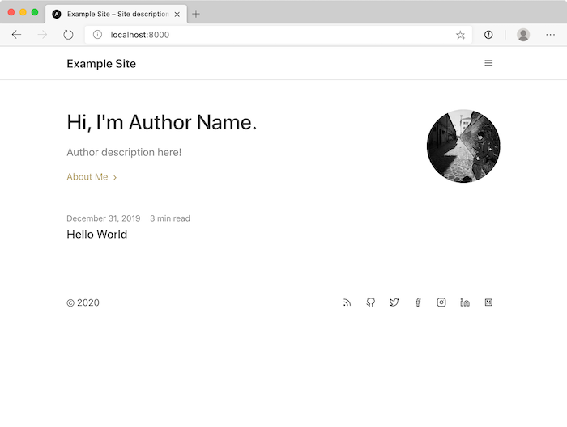

# gatsby-theme-minimalism

Welcome to `gatsby-theme-minimalism`, a Gatsby theme by [Andrew Mok](https://andrewmmc.com). It's a simple Gatsby Theme for blog and static website, easily create contents using Markdown.




## Demo
[Check demo website here](https://andrewmmc.com)

## 🚀 Getting Started
```bash
npm i gatsby-theme-minimalism
## or
yarn gatsby-theme-minimalism
```

## How to use
Edit `gatsby-config.js` and replace `siteMetadata` by the following:
```js
module.exports = {
  siteMetadata: {
    title: '',
    author: 'Author Name',
    authorDescription: 'Author description here!',
    description: 'Site description',
    siteUrl: 'https://examplesite.com',
    seoKeywords: [],
    location: 'Hong Kong',
    email: 'no-reply@email.com',
    social: {
      github: 'github',
      linkedin: '',
      facebook: 'facebook',
      instagram: 'instagram',
      twitter: 'twitter',
      medium: '',
    },
  },
}
```

And add the following config in `plugins`:
```js
module.exports = {
  plugins: [
    {
      resolve: 'gatsby-theme-minimalism',
      // You can edit the following options, or ignore them if you don't care. 
      // Note that siteName is required for RSS.
      options: {
        siteName: '',
        convertKitFormId: '',
        likeCoinId: '',
        mapId: '',
        compactMode: false,
        darkTheme: false,
        showIntro: false,
      },
    },
  ],
}
```

| Options                     | Required? | Description                                                     |
|-----------------------------|-----------|-----------------------------------------------------------------|
| `siteName` (string)         | Y         | Required for RSS                                                |
| `convertKitFormId` (string) | N         | ConvertKit ID for blog posts, will not render if empty          |
| `likeCoinId` (string)       | N         | LikeCoin ID for blog posts, will not render if empty            |
| `mapId` (string)            | N         | Google Maps My Maps ID for about page, will not render if empty |
| `compactMode` (string)      | N         | Gallery view or Compact view for header and home page           |
| `darkTheme` (string)        | N         | Enable dark theme support                                       |
| `showIntro` (string)        | N         | Show Introduction in home page                                  |

## Writing content and replacing images
Check `example-site` for the sample folder structure for blog posts, about page and projects page, by placing markdown files in `content`. You may replace the assets images by creating `assets` folder.

```
.
├── assets
|   ├── about.jpg
|   └── ...
├── content
|   ├── about
|   |   └── index.md
|   ├── blog
|   |   ├── 2020
|   |   |   └── title
|   |   |       └── index.md
|   |   └── ...
|   └── projects
|       └── index.md
└── ...
```

## Customizing the theme
To customize the theme colors used, shadow the files inside `src/gatsby-theme-minimalism/themes`. To extend the colors usage, import the base colors and export a new color object. Check [Component Shadowing](https://www.gatsbyjs.org/blog/2019-04-29-component-shadowing/) for more usage.

## Author
- [Andrew Mok](https://andrewmmc.com) (@andrewmmc)

## Questions?
- Please feel free to [open an issue here](../../issues) or [contact me via email](mailto:hello@andrewmmc.com).